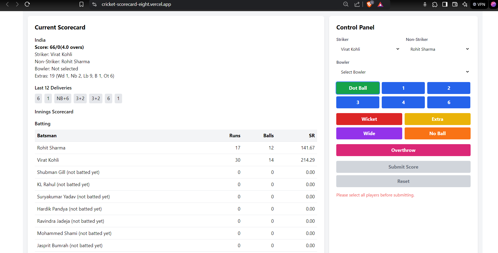

# Cricket Scorer

Cricket Scorer is a real-time, interactive web application designed for scoring cricket matches. It provides a user-friendly interface for managing and displaying cricket match statistics, making it ideal for scorekeepers, cricket enthusiasts, and sports analysts.



## Features

- Real-time score updates
- Support for both innings in a cricket match
- Detailed player statistics (runs, balls faced, wickets, overs bowled, etc.)
- Extra runs tracking (wide, no-ball, leg-bye, bye, overthrow)
- Last 12 deliveries display
- Automatic strike rotation
- Inning completion detection
- Target score and required run rate calculation for the second innings
- Responsive design for various screen sizes

## Technologies Used

- React.js
- TypeScript
- Axios for API calls
- Tailwind CSS for styling
- Context API for state management

## Setup and Installation

1. Clone the repository:
   ```
   git clone https://github.com/ayush11122/cricket-scorecard.git
   ```

2. Navigate to the project directory:
   ```
   cd cricket-scorecard
   ```

3. Install dependencies on both Frontend and Backend:
   ```
   npm install
   ```

4. Start the development server:
   ```
   npm start dev
   ```

5. Open your browser and visit `http://localhost:3000` to view the application.

## Usage

1. Select the striker, non-striker, and bowler from the dropdown menus.
2. Use the control panel to input runs, extras, and wickets for each ball.
3. Click the "Submit Score" button to update the scorecard.
4. The scorecard will automatically update with the latest statistics.
5. Use the "Reset" button to clear the current input if needed.

## API Integration

This project requires a backend API to function properly. Ensure that your API is running and accessible at `http://localhost:3000/api/v1/`. Update the API endpoint in the `CricketContext.tsx` file if your backend is hosted at a different URL.
